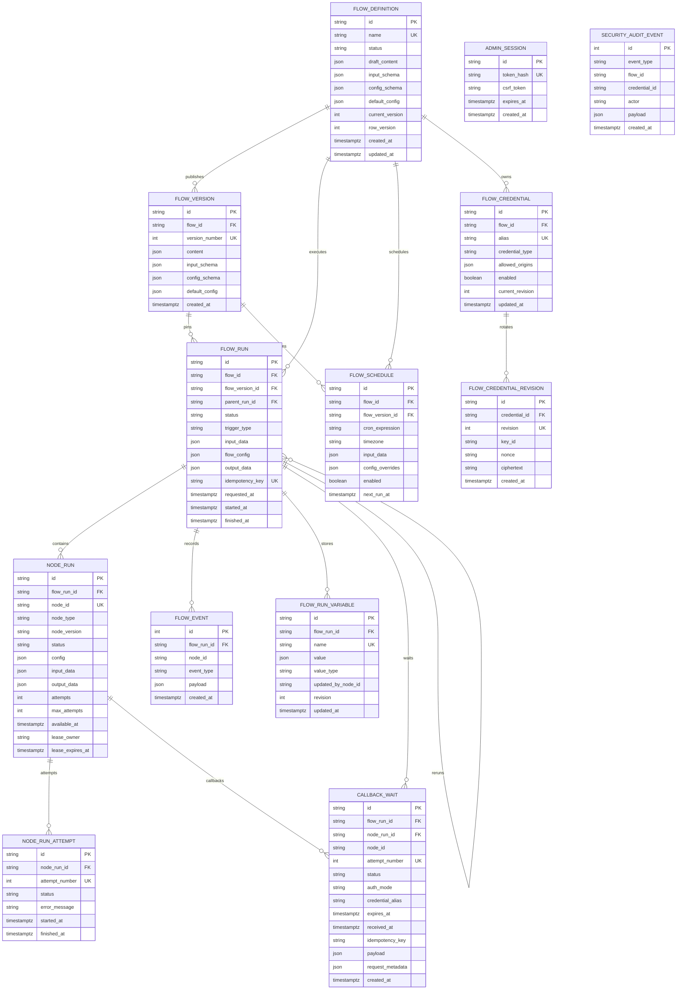

# FlowForge database ERD

The PostgreSQL schema is owned by SQLAlchemy models in
`backend/app/models.py` and versioned by Alembic migrations in
`backend/alembic/versions/`. Alembic is the source of truth for deployed
database changes; the models describe the current application mapping.

## Entity relationships



`security_audit_event.flow_id` and `credential_id` are deliberately logical
references rather than foreign keys. Security history therefore survives a
permitted deletion of the referenced object. `admin_session` is intentionally
independent of workflow execution data.

## Table responsibilities

| Table | Responsibility | Retention behavior |
|---|---|---|
| `flow_definition` | Mutable designer draft and current operational status | Parent record for versions, schedules and credentials |
| `flow_version` | Immutable published graph, input schema and Flow Configuration defaults | A run always pins one version |
| `flow_run` | Durable execution, trigger provenance, input and merged configuration snapshot | Parent record for runtime state and events |
| `flow_schedule` | Cron trigger pinned to a published version | Deleted with its Flow |
| `node_run` | Durable state and lease for one node in one run | Deleted with its run |
| `node_run_attempt` | Attempt-level status, timing and error history | Deleted with its node run |
| `callback_wait` | Callback URL attempt, inbound authentication, expiry, idempotency and sanitized payload | Deleted with its run; a completed URL cannot be consumed twice |
| `flow_event` | Ordered SSE/audit timeline including `CREDENTIAL_USED` | Deleted with its run |
| `flow_run_variable` | Run-scoped typed JSON variables and writer revision | Deleted with its run |
| `flow_credential` | Flow-local alias, auth type, exact origin allowlist and active revision | Secret data is never stored here |
| `flow_credential_revision` | AES-256-GCM nonce/ciphertext and Key Ring ID | Deleted with its credential; revisions are immutable |
| `admin_session` | Hashed opaque session token, CSRF token and expiry | Expired rows are cleaned during login/session checks |
| `security_audit_event` | Credential create/rotate/enable/disable/delete-attempt history | Intentionally independent of foreign keys |

## Inspect with Adminer

Start the stack and open [http://localhost:8080](http://localhost:8080). Use:

```text
System:   PostgreSQL
Server:   database
Username: value of POSTGRES_USER (default: workflow)
Password: value of POSTGRES_PASSWORD (default: workflow)
Database: value of POSTGRES_DB (default: workflow)
```

The server is `database`, not `localhost`, because Adminer runs inside the
Compose network. This service is for local development only; do not expose port
8080 in a shared or production environment.

Useful SQL:

```sql
-- Published flows and their versions
SELECT f.name, f.status, v.version_number, v.created_at
FROM flow_definition AS f
JOIN flow_version AS v ON v.flow_id = f.id
ORDER BY f.name, v.version_number DESC;

-- Recent runs with their pinned version
SELECT r.id, f.name, v.version_number, r.trigger_type, r.status,
       r.requested_at, r.finished_at
FROM flow_run AS r
JOIN flow_definition AS f ON f.id = r.flow_id
JOIN flow_version AS v ON v.id = r.flow_version_id
ORDER BY r.requested_at DESC
LIMIT 50;

-- Active or recently received external callbacks
SELECT id, flow_run_id, node_id, status, auth_mode,
       credential_alias, expires_at, received_at
FROM callback_wait
ORDER BY created_at DESC
LIMIT 50;

-- Credential metadata only (ciphertext is intentionally excluded)
SELECT f.name, c.alias, c.credential_type, c.allowed_origins,
       c.enabled, c.current_revision, c.updated_at
FROM flow_credential AS c
JOIN flow_definition AS f ON f.id = c.flow_id
ORDER BY f.name, c.alias;

-- Credential usage events without authentication headers or secrets
SELECT e.flow_run_id, e.node_id, e.payload, e.created_at
FROM flow_event AS e
WHERE e.event_type = 'CREDENTIAL_USED'
ORDER BY e.id DESC
LIMIT 50;

-- Durable worker queue and lease state
SELECT flow_run_id, node_id, node_type, status, attempts,
       available_at, lease_owner, lease_expires_at
FROM node_run
WHERE status NOT IN ('SUCCESS', 'FAILED', 'CANCELLED', 'SKIPPED')
ORDER BY available_at;
```

## Migration workflow

```powershell
cd backend
alembic current
alembic history
alembic upgrade head
```

Create a new Alembic revision for every schema change. Do not edit an applied
migration or rely on `Base.metadata.create_all()` in deployed environments.
